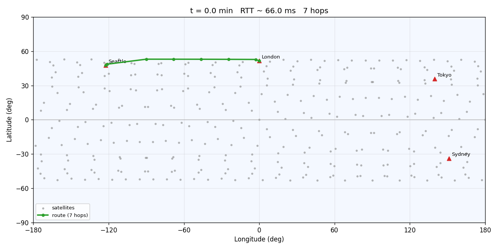
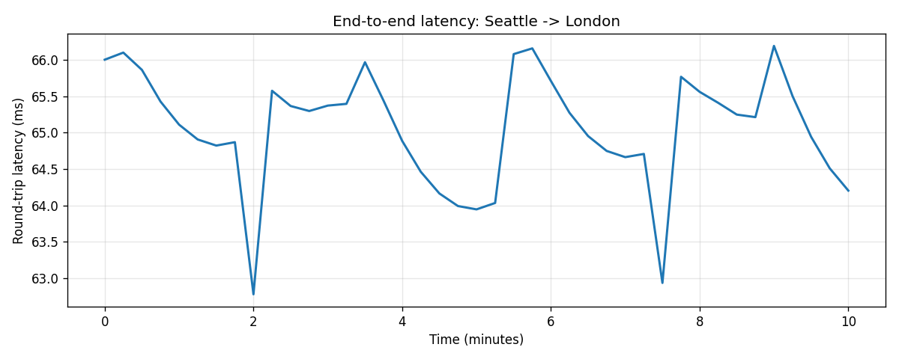
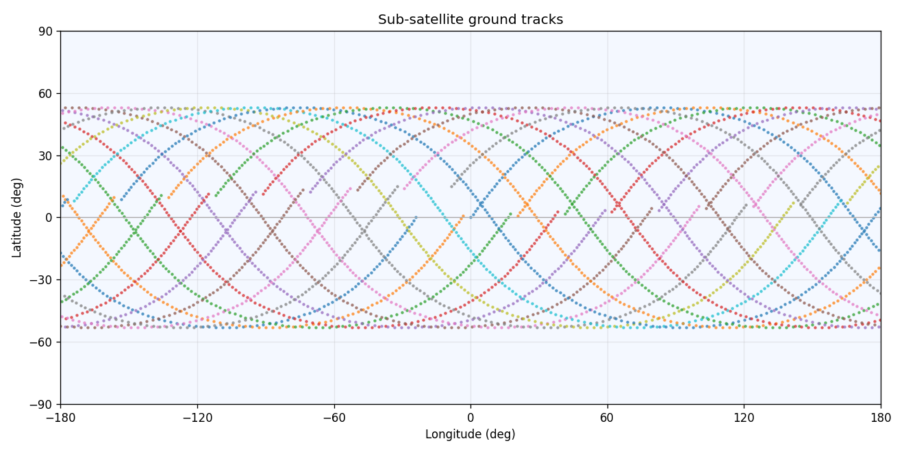

# Constellation-Sim — A LEO Satellite Network Routing Simulator

A physics-based simulator that models a **Starlink-style low-Earth-orbit (LEO)
constellation** and the **dynamic network** that routes user traffic across it.
It propagates hundreds of satellites along their orbits, builds the live link
graph at each instant (inter-satellite laser links + ground up/downlinks), and
computes the **least-latency route** between two points on Earth as the
constellation moves overhead.

> Built as a capstone to explore the problems a Starlink software team works on
> every day: orbital mechanics, a constantly changing network topology, and
> real-time least-latency routing across thousands of moving nodes.



---

## Why this project

Starlink "directs data through an ever-changing network of satellites, ground
stations, planes and users." That single sentence hides three hard problems,
and this project implements a readable version of each:

| Real Starlink problem | What this repo models |
| --- | --- |
| Satellites are always moving | Circular two-body orbital propagation in ECI/ECEF frames |
| The network topology changes every second | Link graph is rebuilt from geometry at every timestep |
| Traffic must take the fastest path *right now* | Dijkstra least-latency routing over the live graph |
| Links break and re-form (handovers) | Per-step path tracking + handover/availability metrics |

## Example results

Routing **Seattle → London** over a 324-satellite shell (18 planes × 18
satellites, 550 km, 53° inclination), sampled every 15 s for 10 minutes:

```
availability_pct : 100.0      # destination reachable every sample
min_latency_ms   : 62.8       # RTT, propagation only
mean_latency_ms  : 65.1
max_latency_ms   : 66.2
mean_hops        : 6.9        # satellites traversed per path
handovers        : 13         # route changes over the run
```

For reference, terrestrial fiber Seattle↔London is ~130–140 ms RTT, so the
~65 ms figure correctly reflects LEO's latency advantage on long-haul links.

| Latency over time | Ground tracks |
| --- | --- |
|  |  |

## How it works

```
                 ┌──────────────┐
   parameters →  │ constellation│  Walker-Delta: P planes × S sats
                 └──────┬───────┘
                        │ Satellite(orbit)
                        ▼
                 ┌──────────────┐
   time  t   →   │   orbits     │  position_ecef(t)  (Kepler + frame rotation)
                 └──────┬───────┘
                        ▼
                 ┌──────────────┐
                 │   network    │  visibility + ISL grid → weighted graph
                 └──────┬───────┘  edge weight = distance / c
                        ▼
                 ┌──────────────┐
   src, dst  →   │   routing    │  Dijkstra least-latency path
                 └──────┬───────┘
                        ▼
                 ┌──────────────┐
                 │  simulate    │  step the clock, repeat → timeseries
                 └──────┬───────┘
                        ▼
                 metrics  +  visualize
```

**Orbits** (`orbits.py`) — Each satellite follows a circular two-body orbit.
Positions are computed in the inertial (ECI) frame, then rotated into the
Earth-fixed (ECEF) frame by the Greenwich hour angle so ground stations stay
put. Tested against Kepler's third law and orbit-closure.

**Network** (`network.py`) — At a given time the simulator forms a graph:
ground↔satellite links are gated by a minimum **elevation angle**;
satellite↔satellite laser links follow a `+grid` topology (in-plane neighbours
+ adjacent-plane neighbours) and are dropped if they exceed max range or are
**occluded by the Earth** (a closest-approach line-of-sight test). Every edge is
weighted by one-way light-speed delay.

**Routing** (`routing.py`) — A binary-heap **Dijkstra** finds the minimum total
delay path. Because edge weights are propagation delays, the path cost *is* the
end-to-end latency.

**Simulate / metrics** (`simulate.py`, `metrics.py`) — The driver steps the
clock, rebuilds the graph (the satellites have moved), and re-routes. Metrics
reduce the run to latency stats, hop counts, **handovers** (path changes), and
**availability**.

## Quickstart

```bash
git clone <your-repo-url>
cd constellation-sim
pip install -r requirements.txt

# Run the test suite
pytest

# Run the end-to-end demo (prints metrics, writes plots to docs/media/)
python examples/run_demo.py
```

Minimal API usage:

```python
from constellation_sim import GroundNode, walker_delta, run_simulation, summarize

sats = walker_delta(num_planes=18, sats_per_plane=18,
                    inclination_deg=53.0, altitude_km=550.0)
ground = [GroundNode("Seattle", 47.61, -122.33),
          GroundNode("London", 51.51, -0.13)]

result = run_simulation(sats, ground, "Seattle", "London",
                        duration_s=600, step_s=15)
print(summarize(result).as_dict())
```

## Project layout

```
src/constellation_sim/
  constants.py       physical constants (km, s, c, mu)
  orbits.py          circular-orbit propagation + ECI/ECEF/geodetic conversions
  constellation.py   Walker-Delta constellation builder
  network.py         link visibility, ISL topology, weighted graph build
  routing.py         Dijkstra least-latency routing
  simulate.py        time-stepped driver -> SimulationResult
  metrics.py         latency / hops / handovers / availability summary
  visualize.py       2D route map, latency plot, ground tracks
examples/run_demo.py demo: Seattle -> London
tests/               pytest suite (orbits, routing, network, constellation, sim)
.github/workflows/   CI: pytest + demo smoke test on 3.10–3.12
```

## Modelling choices & limitations

Honest about fidelity — this is a constellation-geometry and routing study, not
a flight-dynamics package:

- **Circular two-body orbits**; no J2 oblateness, drag, or maneuvers.
- **Spherical Earth** for occlusion and geodetic conversions.
- **Latency = propagation delay only** (queuing, processing, and serialization
  are not modelled).
- **Static `+grid` ISL topology**, range/LOS-gated per step but not
  capacity- or congestion-aware.

## Roadmap

- [ ] J2 perturbation and SGP4/TLE ingestion for real ephemerides
- [ ] Capacity- and congestion-aware routing (weighted by load, not just delay)
- [ ] Port the per-step graph build + Dijkstra hot path to **C++** with a
      `pybind11` binding (the current pure-Python version is the reference impl)
- [ ] Animated GIF of a route handing over between satellites
- [ ] Multiple shells and inter-shell routing

## License

MIT — see [LICENSE](LICENSE).
